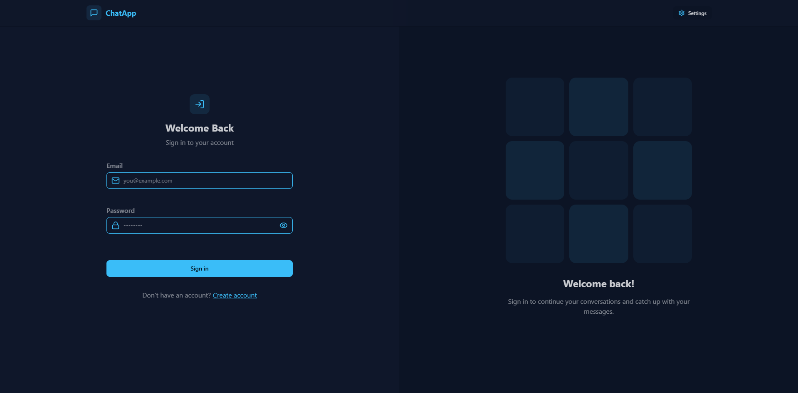
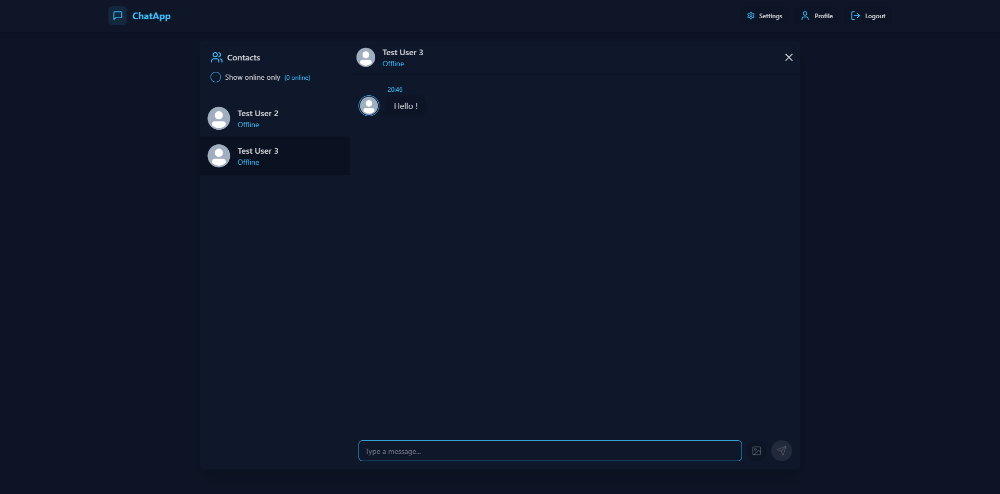
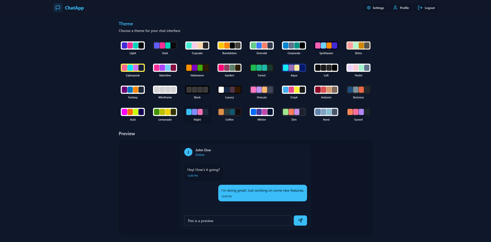

# MERN Stack: ChatApp | JWT, Socket.io

## Technologies Used

**Frontend:** React, Zustand, Tailwind CSS, DaisyUI

**Backend:** Node.js, Express.js, Mongoose

**Real-Time Communication:** Socket.io

**Database:** MongoDB


## Screenshots






## Environment Variables

To run this project you will need to add the following environment variables to your .env file

```
MONGODB_URI=

PORT=

JWT_SECRET=

CLOUDINARY_CLOUD_NAME=
CLOUDINARY_API_KEY=
CLOUDINARY_API_SECRET=

NODE_ENV=development (optional)
```

  